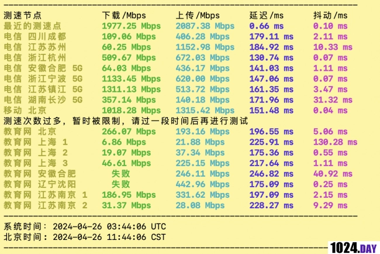
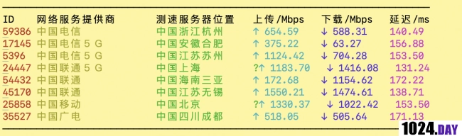
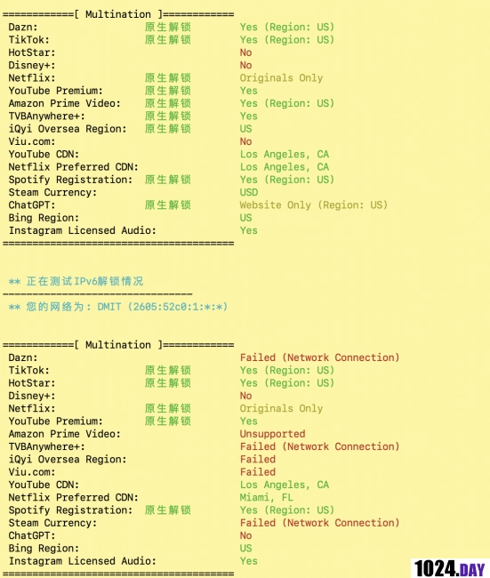
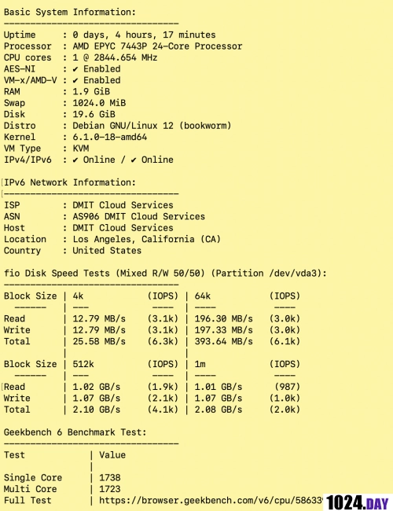

# DMIT Los Angeles CMIN2 Route: LAX EB Plan Deep Dive

---

If you're hunting for a US VPS that actually works well from China, you've probably hit the usual wall: bloated latency, packet loss nightmares, or straight-up blocked IPs. DMIT just rolled out their LAX EB plan using triple-network CMIN2 routing, and honestly? It's one of those rare setups that makes you go "finally, someone gets it." Let's see if this thing lives up to the hype or if it's just another oversold pipe dream.

---

## What You're Actually Getting

First things first: AMD 7003 series CPU, nothing fancy but solid enough for actual work. The real showstopper? 2Gbps bandwidth allocation. That's not a typo—2 gigs. Most budget VPS providers are still choking you with 1Gbps shared among 50 users, so this already feels like breathing room.

The specs look good on paper. But specs mean nothing if the routing sucks or if you're sharing that bandwidth with a crypto miner next door. Time to actually test this thing.

## Speed Tests Across China's Big Three ISPs

Test IP: 154.17.226.2

Running speed tests from China Telecom and China Mobile nodes gave pretty encouraging results. China Telecom pulled respectable speeds, and Mobile was legitimately fast—that 2Gbps pipe isn't just for show. China Unicom initially didn't want to cooperate (classic Unicom), but after some prodding:

China Unicom follow-up test:

Speeds are solid across the board. No weird throttling, no random drops to double digits. This is what you want to see when you're paying for premium routing.

## The Route That Actually Matters: Return Path Analysis

Outbound is straightforward: China Telecom and China Unicom take CN2, Mobile rides CMIN2. Nothing groundbreaking there.

But the return path? This is where DMIT shows they actually did their homework. All three carriers route back through Los Angeles directly via AS58807 (CMIN2), exiting through Shanghai. If you're in southern China, your latency is going to be noticeably lower than typical west coast routes.

For anyone doing cross-border business between US and China, having properly optimized routes isn't just nice—it's the difference between "workable" and "why is everything timing out." The US VPS market desperately needs more providers willing to invest in proper peering instead of just dumping traffic onto whatever's cheapest.

👉 [Get consistently low-latency routing that doesn't fall apart during peak hours](https://www.dmit.io/aff.php?aff=13832)

The route traces are clean. No weird detours through tier-3 carriers, no random hops that add 50ms for no reason. Just direct, predictable routing that does exactly what you'd expect premium transit to do.

One genuinely impressive detail: DMIT actually optimized IPv6 routing too. Most providers treat IPv6 like an afterthought, but here all three carriers properly route through CMIN2 for v6 traffic. If you're running dual-stack services, this matters more than you'd think.

## Streaming and IP Reputation

Media unlocking is middling—nothing spectacular, but the important part is the IPs aren't flagged or banned in China. For a US-based VPS, that's actually a minor miracle these days. Many providers end up with entire IP blocks blacklisted before they even realize it.

## Performance Benchmarks: The Good and The Questionable

Geekbench 6 CPU score came in around 1700+, which is legitimately excellent for a VPS. Single-core performance is strong enough for most web workloads, and multi-core holds up well under load.

But the disk I/O? Either they're rate-limiting writes or the storage backend is struggling. It's functional, but definitely not going to win any speed records. My guess is intentional throttling to prevent abuse—understandable from their perspective, but worth noting if you're planning disk-intensive operations.

## The Actual Verdict

DMIT's LAX EB plan is one of those rare instances where a provider actually delivers what they promise. The routing is genuinely premium, the hardware doesn't oversell itself, and the bandwidth allocation is generous enough to be useful. Whether you're running cross-border services or just need a reliable connection back to China that won't randomly die during dinner time, this setup handles it.

The disk I/O is the only real compromise, but for most use cases (web hosting, proxy services, application servers), it's not going to be your bottleneck anyway. 

If you've been burned by oversold "optimized" VPS plans before, this is worth testing. The routing alone makes it stand out in a market that's mostly race-to-the-bottom pricing with race-to-the-bottom quality. Sometimes you actually get what you pay for.
